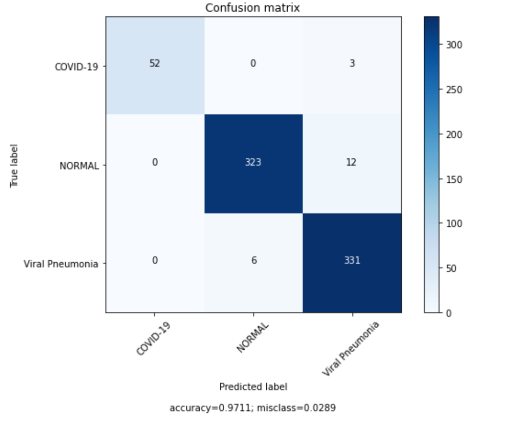
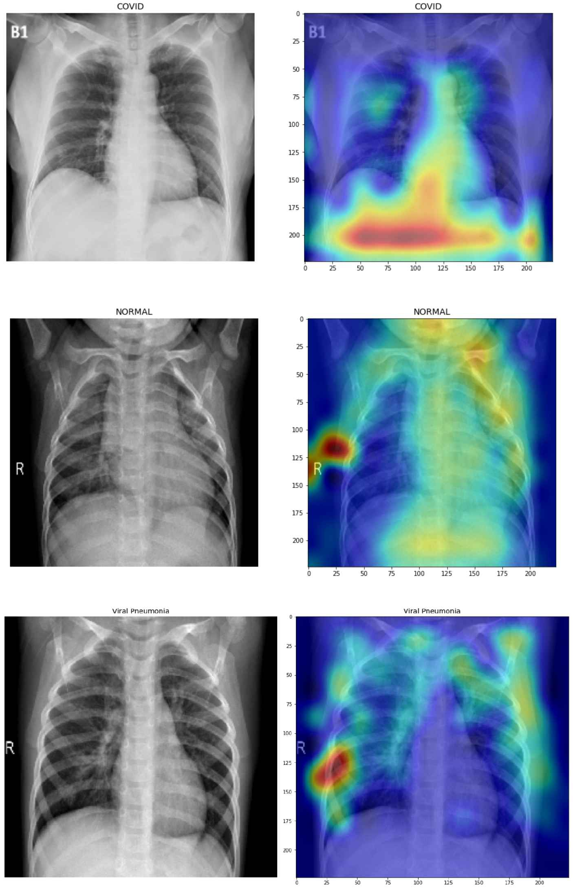

<div align="center">
  
</div>

<h1 align="center"> Covid4HPC </a></h1>
<h4 align="center"> A fast and accurate solution for Covid-19 detection  </a></h4>

<p align="center">
  <a href="#Setup">Setup</a> •
  <a href="#FPGA-demo">FPGA demo</a> •
  <a href="#Steps-for-FPGA-inference">Steps for FPGA inference</a> •
  <a href="#Results">Results</a> •
  <a href="/build/keras_model/">Pretrained models</a> •
    <a href="#Contact">Contact</a>
</p>

#### Youtube Video
[](https://www.youtube.com/watch?v=INisAnTdnXA)

Covid4HPC is a Deep Learning application that uses Neural Networks to detect Covid-19 disease from X-Ray images. Also, the application is accelerated through Cloud FPGAs (specifically Xilinx Alveo U50) and achieves significant performance and accuracy as well. This project is not intended for self-diagnosis and anyone should seek help from their local health authorities if needed.

### Features
- Input data: 224x224 chest X-ray images
- Dataset: Kaggle COVID-19 Radiography Database [[link]](https://www.kaggle.com/tawsifurrahman/covid19-radiography-database "Named link title")
- Classes: "COVID-19", "Normal", "Viral Pneumonia" 	
- Accuracy: 97%
- Inference Speed (FPGA): 3700 FPS
</div>
---


## Setup

- An Ubuntu host PC (16.04 or 18.04)
- Setup Alveo U50 FPGA Card if you haven't already. Install XRT and Alveo target platform files. [[Follow instructions]](https://github.com/Xilinx/Vitis-AI/tree/master/alveo-hbm "Named link title")
- Install Docker and ensure your linux user is in the docker group:
```bash
sudo apt install docker -y
sudo groupadd docker
sudo usermod -aG docker $USER
newgrp docker
```
- Download our github repo (~70MB in size)
```bash
git clone https://github.com/dimdano/Covid4HPC.git
```
- Pull and run Vitis AI prebuilt docker (release 1.2.82 recommended) - Vitis AI.
```bash
chmod +x docker_run.sh
./docker_run.sh xilinx/vitis-ai-cpu:latest
```
- Install Xilinx DPU IP for the Alveo U50. While inside docker run:
```bash
wget https://www.xilinx.com/bin/public/openDownload?filename=alveo_xclbin-1.2.1.tar.gz -O alveo_xclbin-1.2.1.tar.gz
tar xfz alveo_xclbin-1.2.1.tar.gz
sudo cp alveo_xclbin-1.2.1/U50/6E300M/* /usr/lib
``` 
- You can head to [FPGA-demo](#FPGA-demo) to test the ready-to-run application. For the other tutorials you will need to download COVID-19 Radiography dataset from [here](https://www.kaggle.com/tawsifurrahman/covid19-radiography-database). Then place the 3 class folders (Covid, Normal, Viral Pneumonia) inside the dataset folder of the repo.


<!---
### Steps for testing inference on GPU
- Move to `run_gpu` folder
- Download X-ray images from [here](https://www.kaggle.com/tawsifurrahman/covid19-radiography-database "Named link title") and put the 3 Folder classes (Covid, Normal, Viral_Pneumonia) inside `xray_images` folder.
- Run either `train_custom.py` to train the Custom CNN or `train_dense.py` to train the DenseNetX model.
- Tensorboard files are saved in `tb_logs` folder and model with lowest val. loss is saved as `xray_model_best.h5`
--->

  
## Steps for FPGA inference
Follow the next steps to run the Vitis-AI tools for FPGA deployment and inference of the model. The tutorial runs for CustomCNN model by default. If you would like to use the DenseNetX model run `source ./0_setenv.sh DenseNetX` instead of `source ./0_setenv.sh`.

0. First run the script to set variables and activate vitis-ai-tensorflow:
  ```bash
  source ./0_setenv.sh
  ```
1. Convert the model to TF Frozen Graph by running the following command:
```bash
source ./1_keras2tf.sh
  ```
2. Evaluate the prediction accuracy on the 32-bit model.
```bash
source ./2_eval_frozen.sh
  ```
3. Quantize from 32-bit floating point to 8-bit fixed point with calibration images:
```bash
source ./3_quant.sh
  ```
4. Evaluate the prediction accuracy of the quantized 8-bit model:
```bash
source ./4_eval_quant.sh
  ```
5. Compile the quantized model and generate the xmodel file for the target FPGA (Alveo U50):
```bash
source ./5_compile.sh 
  ```
6. Prepare the application folder and generate the test images:
```bash
source ./6_make_target.sh
  ```
7. Go to `build/target/` folder and run application with:
```bash
/usr/bin/python3 run_inference.py -m model_dir/fpga_model.xmodel -t 8
  ```
Note* The DPU runs at 300MhZ. If you experience issues with the FPGA becoming unstable, it might need reset. You can scale down the frequency to overcome these issues. For example run the following to reduce to 250Mhz:
```bash
/opt/xilinx/xrt/bin/xbutil program -p /usr/lib/dpu.xclbin
/opt/xilinx/xrt/bin/xbutil clock -d0 -g 83
 ```
 
 ## FPGA demo
 If you want to test the ready-to-run application head to [FPGA_demo/](FPGA_demo) folder and run the following command to test the CustomCNN model on FPGA:
 ```bash
 /usr/bin/python3 run_inference.py -m model_dir/CustomCNN.xmodel -t 8
 ```
The Frames/Sec (FPS) and Accuracy achieved will be shown. Also, a .txt file will be generated with the predicted images. You can select the model to infer with -m option or the number of threads with -t option. (If you experience issues with FPGA see Note* )
Output:
 ```bash
-----------------------------------------
Running on Alveo U50
-----------------------------------------
Command line options:
 --image_dir :  images
 --threads   :  8
 --model     :  model_dir/fpga_model.xmodel
-----------------------------------------
Number of images:  727
FPS=3606.41, total frames = 727 , time=0.2016 seconds
Correct: 703 Wrong: 27 Accuracy:0.9628
```
 
## SW-evaluation
A jupyter notebook [cpu-evaluation.ipynb/](cpu-evaluation.ipynb) is provided to evaluate the model on several classification metrics in SW. Also, you can visualize the regions of attention of the X-ray images. 
First source Vitis AI environment:
  ```bash
source ./0_setenv.sh  
 ```
For the visualization package only, you will need to install a higher TF-version and tf_keras_vis package by running the following command:
  ```bash
pip install tensorflow==2.0.2 tf_keras_vis 
```
Then, while inside the docker container you can run jupyter (port 8888 enabled in host).
  ```bash
jupyter notebook --no-browser --port=8888 --allow-root
  ```
 Next, copy the URL shown afterwards in a host browser to run jupyter.
 
## Results
The results here are reported for the "CustomCNN" model but you can easily change the model through the notebook provided.

#### Classification Report

```bash
Loss:  0.10907891045799774
Accuracy:  0.97111416
========================================================
                 precision    recall  f1-score   support

       COVID-19       1.00      0.95      0.97        55
         NORMAL       0.98      0.96      0.97       335
Viral Pneumonia       0.96      0.98      0.97       337

       accuracy                           0.97       727
      macro avg       0.98      0.96      0.97       727
   weighted avg       0.97      0.97      0.97       727

========================================================
```

#### Confusion Matrix

<div align="left">
  
</div>


#### Performance vs other systems
We compared the throughput of the model in FPGA with CPU and GPU using the default settings for an inference in keras.

Architecture  | System                               | Frames/second 
------------- | ------------------------------------ | -------------
CPU           | Intel Xeon Silver 4210 (20-thread)   |       204
GPU           | Nvidia V100                          |      1157
FPGA          | Xilinx Alveo U50                     |      3606


#### Visualizations
Another way to demonstrate the results in the qualitative comparison, was to generate saliency maps for our model’s predictions using tf-keras-vis package. These visualizations are very important because they give us an insight on the model's classifier capability as well as validate the regions of attention. 

<div align="center">
  
</div>


## Credits

This software uses the following open source packages:

- [Tensorflow ](https://github.com/tensorflow/tensorflow)
- [Vitis-AI](https://github.com/Xilinx/Vitis-AI)
- [tf-Keras-vis](https://github.com/keisen/tf-keras-vis)

## Contact

    Dimitrios Danopoulos: dimdano@microlab.ntua.gr
